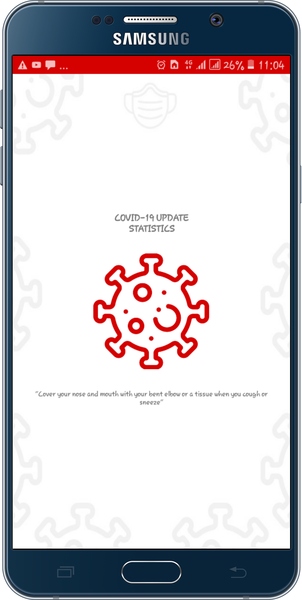
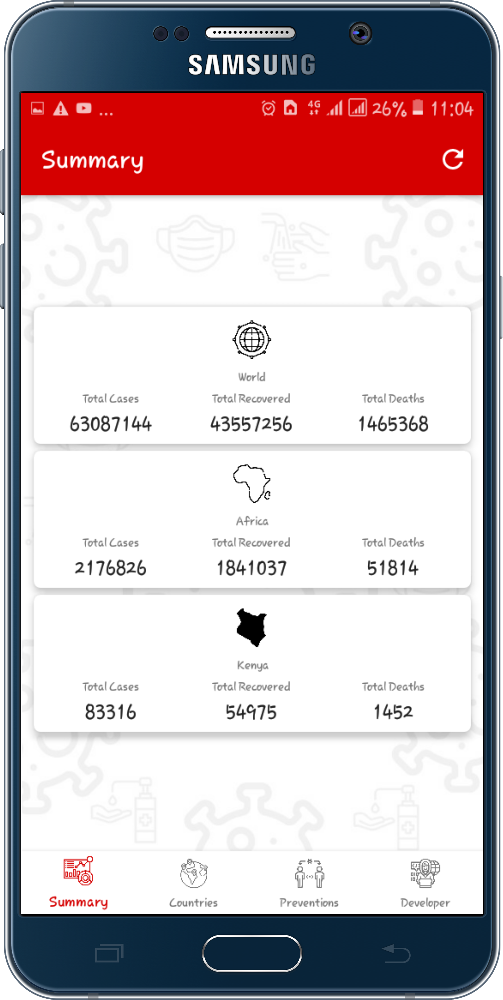
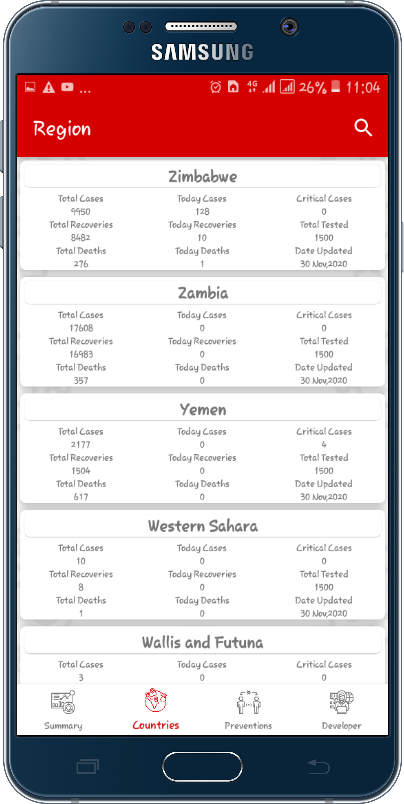
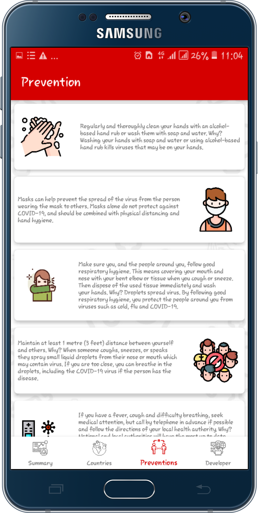

# Covid19 Stats App

It displays 
<ul>
  <li>summary of the statistics i.e World, Africa and Kenya.</li>
  <li>statistics on each country around the globe</li>
  <li>prevention measures</li>
</ul>
 

## Download App
The link to this app can be downloaded here : <a href ="https://drive.google.com/file/d/1DEE2FvTC9EQTGB-Rikq1TWEh1LokQ-xw/view?usp=sharing">Click here to download</a>

## App visual images
### splash screen

### summary

### countries

### Filtered search in countries

### prevention

 

## Tools and Libraries used
<ul>
  <li>This app is written 100% in kotlin</li>
  <li>Android Jetpack components used include</li>
    <ul>
      <li>Data BInding - removes many UI framework calls in your activities, making them simpler and easier to maintain.
                        It also improve the app's performance and preventing memory leaks and null pointer exceptions
      </li>
      <li>
        Navigation - ensures a consistent and predictable user experience by adhering to an established set of principles.
      </li>
    </ul>
  <li><a href ="https://square.github.io/retrofit/">Retrofit</a> -  retrieving JSON via a REST based webservice.</li>
  <li>Material Design -  Build a nice looking UI.</li>
</ul>
 
  
## Installation
You need a laptop and latest release of android studio(preferred)

## Usage
Clone this project using this link <a href = "https://github.com/MosesWangira/Covid.git">https://github.com/MosesWangira/Covid.git</a> 
Open the project using android studio

